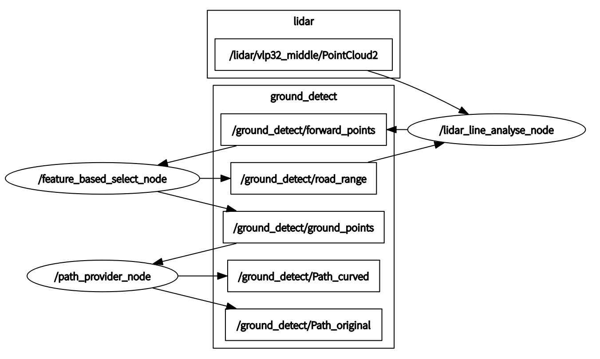
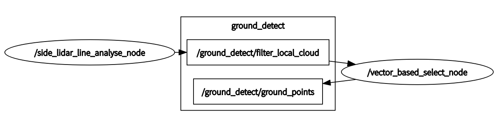
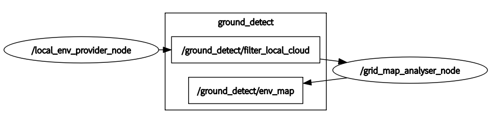

# ground_extarct_in_country_road

基于激光线性特征进行可行驶路径粗提取

-  VLP32C mode(当前),  dual VLP16 mode, VLP32C+ dual VLP16 mode 

- dependency：

  ecl-geometry包

  `sudo apt install ros-kinetic-ecl-geometry`

1. #### VLP32C line feature mode (currently adopt)

   1. 只接受未补偿激光原始32线数据作为输入，因激光角度值用于激光线数判断和每点yaw值计算

   2. ```xml
      ground_detect.launch
      	所选用最低的线数
      	<arg name="low_lines" default="4" />
      	判断为路面的线段距离主线段的最大z轴差距
          <arg name="z_threshold" default="0.06" />
      	成为线段间相邻点的距离阈值（key param）
          <arg name="distance_threshold" default="0.20" />
      	采用输出的坐标系选择
      	<!-- map_tf:1. velo_middle  2. geometry_center-->
          <arg name="map_tf" default="geometry_center" />
      	成为线段的最小点数
          <arg name="lowest_segment_point_num" default="12" />
      	路径生成中噪点忽略阈值
          <arg name="abandon_min_points_num" default="6" />
      ```

   3. `roslaunch ground_detect ground_detect.launch`

   4. - /lidar_line_nanlyse_node:

        将原始激光点`/lidar/vlp32_middle/PointCloud2`进行线数判断(复用intensity字段整数部分)，yaw角计算(复用intensity字段小数部分)，距离选取，并根据上一帧路面点的每一线的角度范围`/ground_detect/road_range`，在当前帧中筛选潜在路面点`/ground_detect/forward_points`后发布

      - /feature_based_select_node:

        在潜在路面点`/ground_detect/forward_points`中寻找线段组并进行合并作为每一线的路面点，，计算每一线的路面点的角度范围`/ground_detect/road_range`并发布，以及选定路面点`/ground_detect/ground_points`

      - /path_provider_node:

        根据选定路面点`/ground_detect/ground_points`求取每一线点的重心，存入缓冲区，并依据多帧结果给出当前帧当前线的路面重心点作为路径点。对所选中线数的路径点进行三次样条拟合，并生成path后发布`/ground_detect/Path_curved`，拟合前path`/ground_detect/Path_original`

      

2. #### dual VLP16 mode

   1. `roslaunch ground_detect ground_detect_2VLP16.launch`

      

3. #### VLP32C+ dual VLP16 grid map mode 

   1. `roslaunch ground_detect ground_detect_grid_map.launch`

      

4. #### VLP32C+ dual VLP16 ransac get_plane  mode 

   1. `roslaunch ground_detect ground_detect_ransac.launch`
